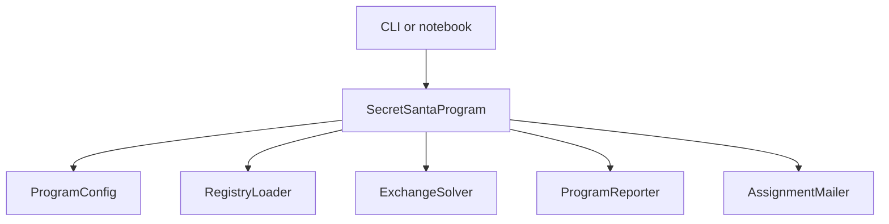
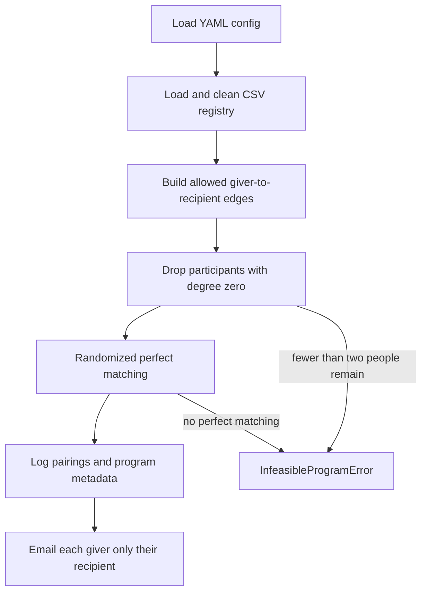

# Architecture

The package in `src/secret_santa/` turns a registry and a YAML config into one gift exchange. A notebook or the command-line interface both call `run_program`.

## Modules

| Module | Responsibility |
| --- | --- |
| `config.py` | Load and validate YAML hyperparameters |
| `registry.py` | Clean the CSV and expand exclusion tokens to names |
| `solver.py` | Build the allowed graph, drop impossible participants, and match the rest |
| `report.py` | Write the organizer log of metadata, validation, and every pairing |
| `emailer.py` | Render one message per giver and send it, or skip sending in mock mode |
| `program.py` | Run those steps in order |
| `cli.py` | Parse `--config` and return a process status code |

## Run sequence

Mail is not attempted when matching fails, or when the assignment fails its invariant checks. The organizer log is written for every successful solve, whether `email.mock_mode` is true or false.

## Data kept apart

The organizer log is the only record of the full matching. `AssignmentMailer` renders `{giver_name}`, `{recipient_name}`, and `{price_limit}` for that giver alone. The subject line is not personalized.

Live delivery uses the standard library SMTP client. Mock mode records that the message was skipped and does not open a connection.
