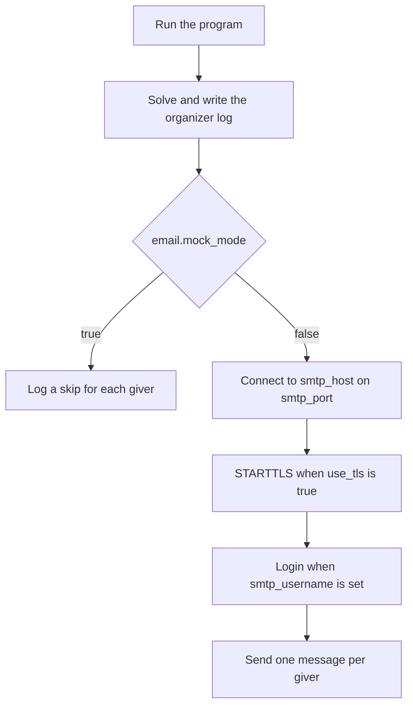

# Email setup

Assignment mail goes out through SMTP after a valid exchange is solved. Each giver receives one message that names only their recipient and the gift price limit. The subject is sent exactly as written, so a mailbox preview cannot reveal an assignment.

The shipped [config.yaml.example](../config.yaml.example) stays in mock mode and does not open a network connection. A local `config.yaml` is listed in `.gitignore` so the Gmail app password stays on the machine that sends mail.



## Create a local config

From the project root:

```bash
cp config.yaml.example config.yaml
```

Edit `config.yaml` on the machine that will send the assignments. Leave `email.mock_mode: true` until a mock run looks right, then switch it to `false` for Gmail.

## Settings that appear in the message

| Setting | Required | Default | Meaning |
| --- | --- | --- | --- |
| `gift_price_limit` | yes | | Positive integer. USD is rendered as `$100`. Any other currency is rendered as `100 EUR`. |
| `currency` | no | `USD` | Currency label, stored in uppercase. |
| `email.subject` | yes | | Subject line. It is not filled in with names. |
| `email.template` | yes | | Body. Must contain `{giver_name}`, `{recipient_name}`, and `{price_limit}`. |

`{price_limit}` is the formatted price, such as `$100`, not the raw integer. Write a literal brace by doubling it: `{{` and `}}`. Any other `{name}` is rejected when that message is rendered.

A block template looks like this:

```yaml
email:
  subject: Your Secret Santa assignment
  template: |
    Hello {giver_name},

    You are the Secret Santa for {recipient_name}.
    Please keep this assignment to yourself.

    A friendly reminder: the gift price limit is {price_limit}.

    Happy holidays.
```

## Delivery settings

| Setting | Required | Default | Meaning |
| --- | --- | --- | --- |
| `email.mock_mode` | yes | | `true` logs each skip and sends nothing. `false` sends through SMTP. |
| `email.from_address` | live mode | | `From` address, and the envelope sender. Must look like `name@example.com` whenever it is set. |
| `email.smtp_host` | live mode | | SMTP hostname. |
| `email.smtp_port` | no | `587` | Port from 1 to 65535. |
| `email.smtp_username` | no | empty | SMTP username. Login is skipped when this is empty. |
| `email.smtp_password` | when a username is set in live mode | empty | SMTP password, Gmail app password, or provider API key. |
| `email.use_tls` | no | `true` | Upgrade the connection with STARTTLS before login. |
| `email.timeout_seconds` | no | `30` | Socket timeout in seconds. Must be greater than zero. |

Live mode (`mock_mode: false`) also requires a valid `from_address` and a non-empty `smtp_host`. Mock mode still checks `from_address` when one is present.

The client is `smtplib.SMTP`. It connects in clear text, then calls STARTTLS when `use_tls` is true, then calls `login(smtp_username, smtp_password)` when a username is set. Implicit TLS on port 465 is not supported. For Gmail, use port `587` with `use_tls: true`.

Providers that expect an API key still use these two fields. Put the key in `smtp_password`, and put whatever username that provider documents in `smtp_username`. A username with an empty password is rejected in live mode.

## Gmail

This program has no "Sign in with Google" flow. Gmail accepts the account through an [app password](https://support.google.com/accounts/answer/185833): a 16-character passcode used in place of the normal Google password. Google only offers app passwords on accounts that have 2-Step Verification turned on.

Use a mailbox you control as the sender. A dedicated Gmail account keeps assignment mail out of a personal inbox. Messages sent by the program are stored in that account's Sent mail, and the organizer log on the machine that runs the program lists every pairing.

### 1. Create the Google account

Open [Create a Google Account](https://accounts.google.com/signup) and finish signup for the address that should appear in `From`. Consumer addresses end in `@gmail.com`. A Google Workspace address can use the same SMTP host when an administrator allows app passwords.

### 2. Turn on 2-Step Verification

1. Sign in as that account.
2. Open [2-Step Verification](https://myaccount.google.com/signinoptions/two-step-verification).
3. Turn it on and complete the phone or prompt setup Google presents.

The app-password page stays hidden until this is on. It also stays hidden when 2-Step Verification is limited to security keys, when the account is enrolled in Advanced Protection, or when a work or school administrator has disabled app passwords.

### 3. Create an app password

1. Open [App passwords](https://myaccount.google.com/apppasswords) while signed in as the sending account.
2. Enter an app name such as `Secret Santa`.
3. Select **Create**.
4. Copy the 16-character password. Google shows it once. The spaces on that screen are only separators.
5. Select **Done**.

Changing the Google account password revokes existing app passwords. Create a new one and update `config.yaml` after a password change. When the exchange is finished, remove the `Secret Santa` entry on that same page.

### 4. Put the password in config.yaml

`smtp_username` and `from_address` are the full Gmail address. `smtp_password` is the app password with the spaces removed. Quote it so YAML keeps every character.

```yaml
email:
  subject: Your Secret Santa assignment
  mock_mode: false
  from_address: family.santa@gmail.com
  smtp_host: smtp.gmail.com
  smtp_port: 587
  smtp_username: family.santa@gmail.com
  smtp_password: "abcdefghijklmnop"
  use_tls: true
  timeout_seconds: 30
  template: |
    Hello {giver_name},

    You are the Secret Santa for {recipient_name}.
    Please keep this assignment to yourself.

    A friendly reminder: the gift price limit is {price_limit}.

    Happy holidays.
```

Gmail accepts mail whose `From` address is the signed-in account. To send as another address, add it first with [Send mail as](https://support.google.com/mail/answer/22370), then set `from_address` to that alias. Leave `smtp_username` as the real Gmail account.

### 5. Send a test before the real registry

Run once with `email.mock_mode: true` and confirm the organizer log. Then point `registry_path` at a small CSV whose addresses you control, set `mock_mode: false`, and run:

```bash
python -m secret_santa --config config.yaml
```

A live success logs one line per giver:

```text
Sent email to Ada <ada@example.com>
```

Mock mode logs `Mock mode: skipped email to ...` instead, and does not contact `smtp.gmail.com`.

Set `seed` to an integer before the first live run if you may need to send again. The same seed reproduces the same assignment. A failed send does not roll back messages Gmail already accepted, and a later run emails every remaining giver again.

Gmail applies its own daily sending cap. A family exchange fits under that cap. The current numbers are in [Gmail sending limits](https://support.google.com/mail/answer/22839).

## When sending fails

| Log or error | What to check |
| --- | --- |
| `Mock mode: skipped email` | `email.mock_mode` is still `true`. |
| `Could not connect to smtp.gmail.com` | Host, port `587`, `use_tls: true`, and outbound network access. Port 465 will not connect with this client. |
| Username and password not accepted | Use the app password, not the Google account password. Remove the spaces. Create a new app password if the Google password changed. |
| `Could not email someone@example.com` | The address was rejected, or Gmail refused `from_address` because it is not the signed-in account or a verified alias. |
| App passwords page is missing | Turn on 2-Step Verification, or use an account whose administrator allows app passwords. |

Google sometimes holds the first sign-in from a new app until the account owner confirms it. Check the sending account's inbox and [Google security notifications](https://myaccount.google.com/notifications), then run the program again.
